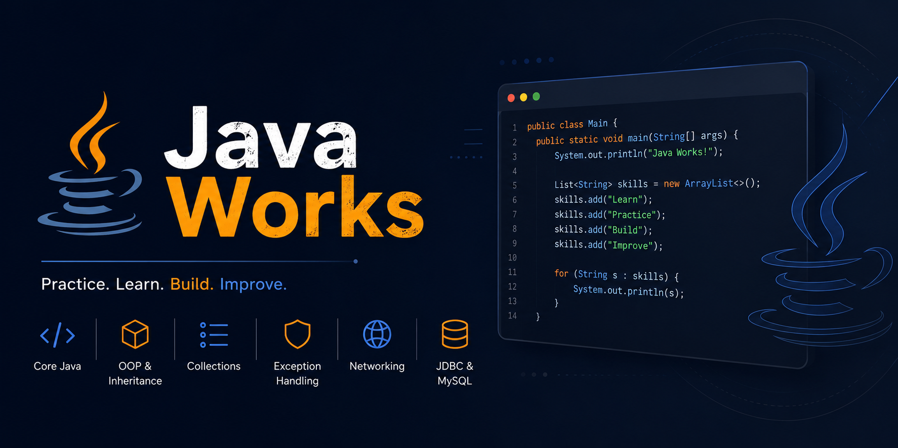

# Java Works

<p align="center">
  
</p>


This repository is a collection of Java practice projects, small demos, and coursework-style exercises. It starts with Java core concepts and expands into inheritance, collections, exception handling, networking, JDBC, and algorithm drills.

## What's inside

- `classes/` - basic Java syntax, objects, methods, file handling, and small standalone examples.
- `inheritance/` - inheritance examples with subclasses such as vehicles, accounts, employees, and products.
- `Interface_abstract/` - interface and abstract class practice, including shapes, animals, vehicles, and payment examples.
- `collections/` - collection-related exercises, including a small social app example in `collections/social_app/`.
- `set_map/` - set, map, sorting, and student-related practice.
- `exceptionhandling/` - custom exceptions and scenarios such as ATM, library, restaurant, and car rental flows.
- `httpworks/` - socket and client/server networking experiments.
- `mysql_java_test/` - JDBC and MySQL access examples.
- `other_things/` - algorithm drills, math exercises, string exercises, and other practice files.

## Runnable examples

Some files in the repository include a `main` method and can be run directly:

- `Testclasses.java`
- `Test_the_classes.java`
- `classes/Demo.java`
- `classes/WorkWithFiles.java`
- `inheritance/Testinheritances.java`
- `collections/social_app/Main.java`
- `httpworks/SocketServer.java`
- `httpworks/ServerClient.java`
- `mysql_java_test/Main.java`
- `other_things/Main.java`

## How to run

Use any recent JDK and run the examples from the repository root.

Example:

```bash
javac inheritance/Testinheritances.java inheritance/*.java inheritance/subclasses/*.java
java inheritance.Testinheritances
```

For package-based files, compile the package and run the fully qualified class name. For top-level files like `Testclasses.java`, compile and run them from the project root.

## Notes

- This project is mainly a learning workspace rather than a single production application.
- Some files are exploratory or duplicated while working through Java concepts.
- The repository currently reflects completed practice on Java core topics, OOP, and SOLID principles, with more experiments added over time.
